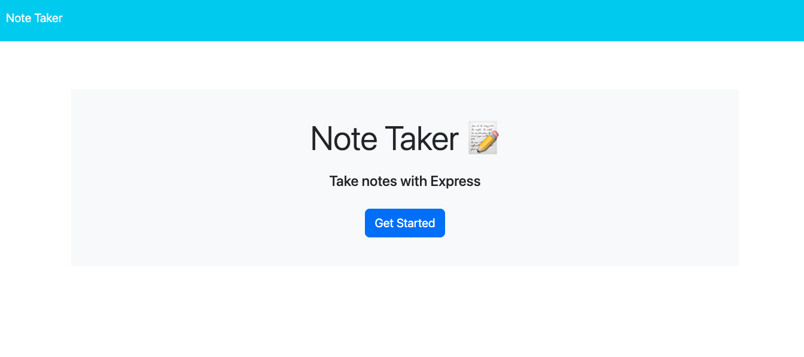
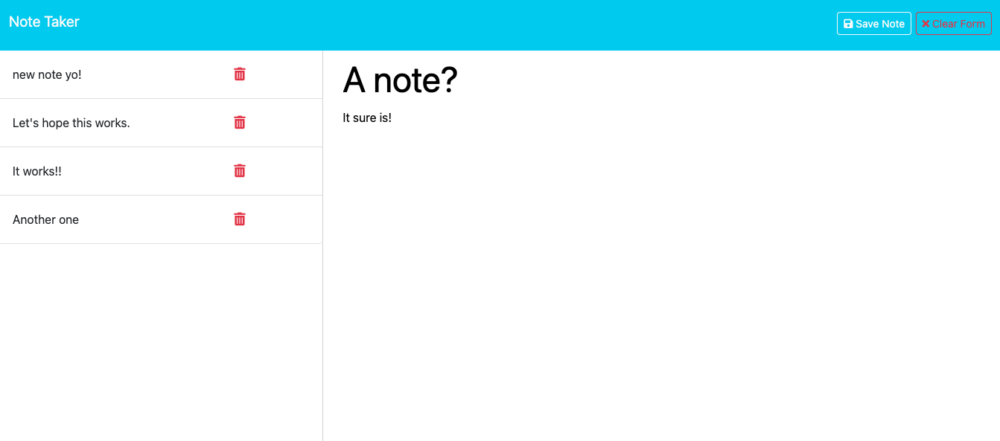

# Better-Than-Paper-Note-Taker 	  

## Table Of Contents
- [Description](#description)
- [Installation](#installation)
- [Usage](#usage)
- [Contributing](#contributing)
- [License](#license)
- [Tests](#tests)
- [Questions](#questions)

# Description
A note taker app for recording all of your ideas and to-do lists.

# Installation
Direct your browser to the note taker app using the link below. This is where the app can be used.

# Usage
From the homepage find the button labeled "Get Started" and click it. This will take you to the notes page. Once there, find the 'Note Title' and 'Note Text' fields and type in the information you want to save on a new note. When finished, click the 'Save Note' button in the upper right hand corner and your new note will be added to the previously saved notes on the left hand side of the browser. If you decide against saving the note you just typed you can click the 'Clear Form' button to abandon it.If you need to access an old note simply click the title and it will be displayed. If you are finished with a note you can remove it by clicking the red trash can icon. This action is not reversable so be certain you can delete it before doing so.

# Contributing
This project was built strictly with the class activities of module 11 and the recorded class lectures.

# Visuals/Links

https://better-than-paper-note-taker.onrender.com

# License
MIT

# Tests
Testing was performed using insomnia to ensure all pathways were connected and working correctly.

# Questions
[GitHub Profile](https://github.com/sdkwapis)
For questions or comments please reach out to me at: sdkwapis@gmail.com